**سوال اول**

در این قسمت از پروژه، عملیات Profiling را با استفاده از Yourkit بر روی کلاس JavaCup اجرا کردیم.
بعد از اجرا متوجه می‌شویم که تابع temp() بیشترین مصرف منابع را دارد و منجر شده است که تابع بعد از آن (eval()) اجرا نشود.
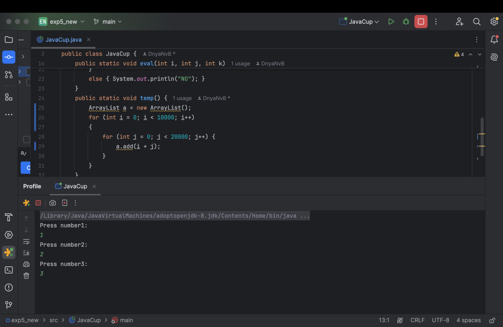
در این تابع یک ArrayList به نام a ایجاد می‌شود که در هر بار اجرای for های تو در تو، برای هر ترکیب از i و j، یک مقدار جدید به آن اضافه می‌شود. این کار منجر به ایجاد تعداد زیادی ابجکت و افزایش غیرضروری مصرف حافظه و زمان پردازش می‌شود، زیرا ArrayList برای هر افزودن یک عنصر جدید به صورت پویا ایجاد می‌کند.
یعنی هر بار که یک عدد جدید به ArrayList اضافه می‌شود، نیاز به تخصیص حافظه جدید برای ذخیره آن وجود دارد. این کار در تعداد زیاد (۲۰۰ میلیون بار for تو در تو) منجر به استفاده زیاد از حافظه می‌شود. همچنین در هر بار اضافه کردن مقدار جدید، ArrayList ممکن است نیاز به جابجایی در حافظه و گسترش سایز خود داشته باشد که این امر باعث مصرف بیشتر منابع و کاهش کارایی می‌شود.

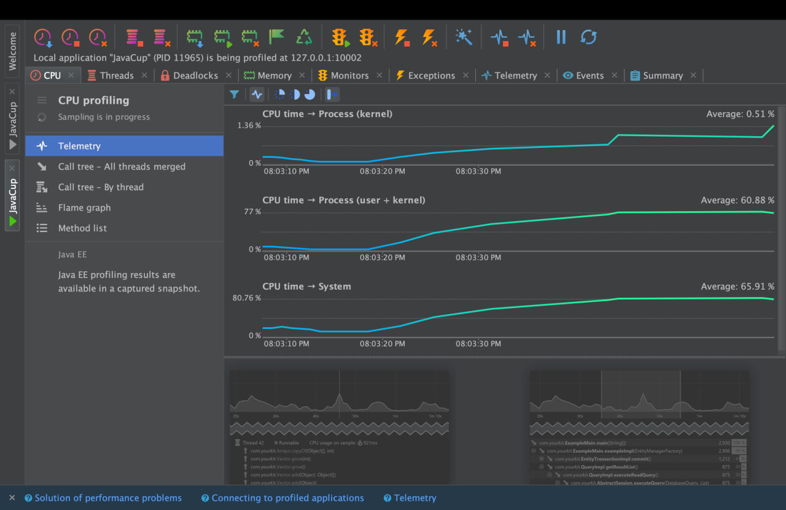
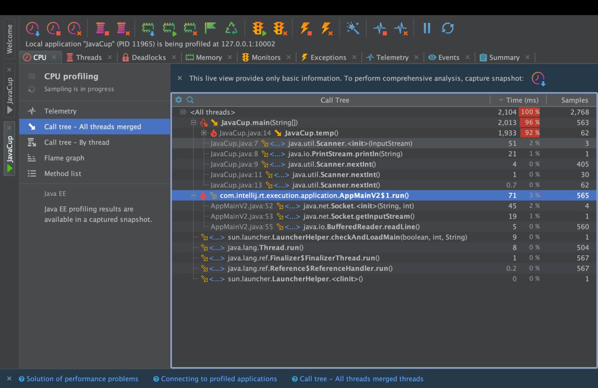
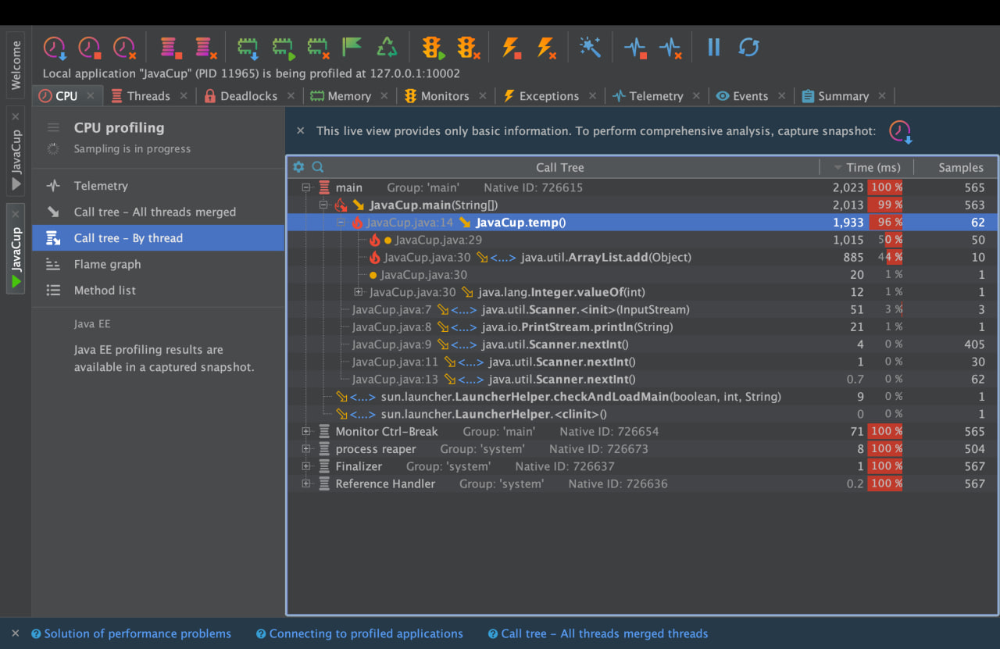
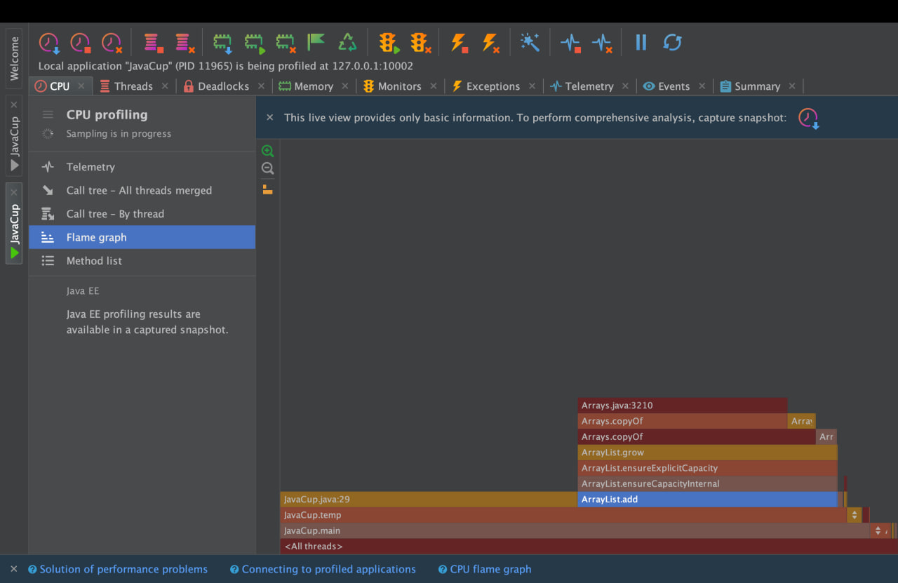
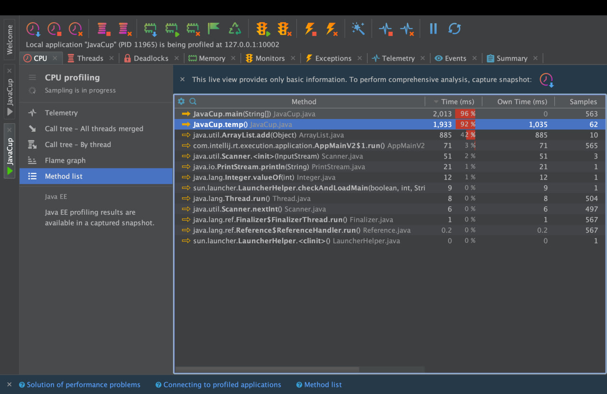
بهینه‌سازی تابع

برای بهینه‌سازی مصرف منابع، می‌توانیم به جای استفاده از یک ArrayList داینامیک، از یک آرایه ثابت استفاده کنیم. این کار باعث کاهش مصرف حافظه و افزایش کارایی می‌شود. در نسخه بهینه‌شده، آرایه‌ای دوبعدی از نوع int با سایز ثابت ایجاد کردیم که حافظه لازم برای ذخیره مقادیر از قبل تخصیص داده شده است. در این قسمت یک آرایه دوبعدی از نوع int به اندازه‌ی ۱۰۰۰۰ در ۲۰۰۰۰ ایجاد کردیم و هر مقدار مستقیما در موقعیت مربوطه از آرایه ذخیره می‌شود، بدون نیاز به عملیات زیاد کردن سایز حافظه یا جابجایی که با اینکار با (با استفاده از آرایه ثابت)، مصرف حافظه به صورت بهینه‌تری مدیریت می‌شود.

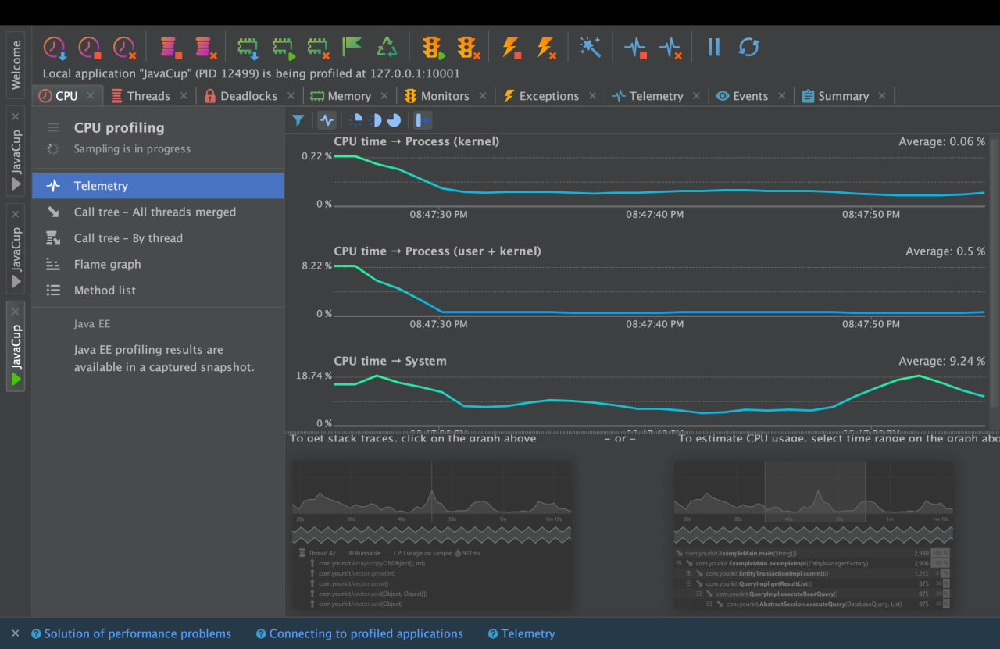
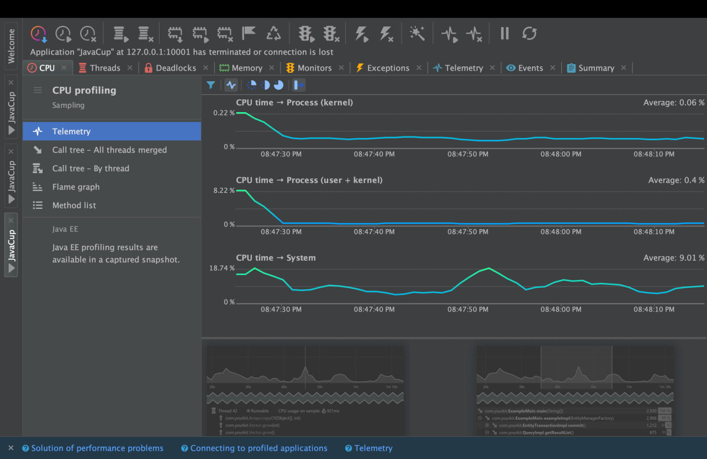
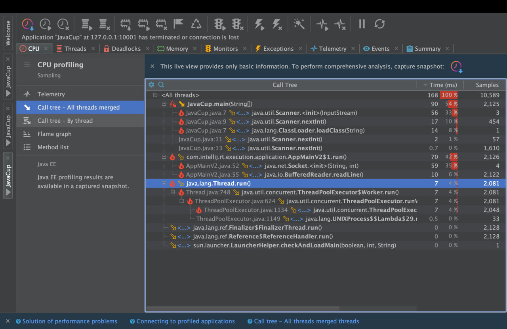
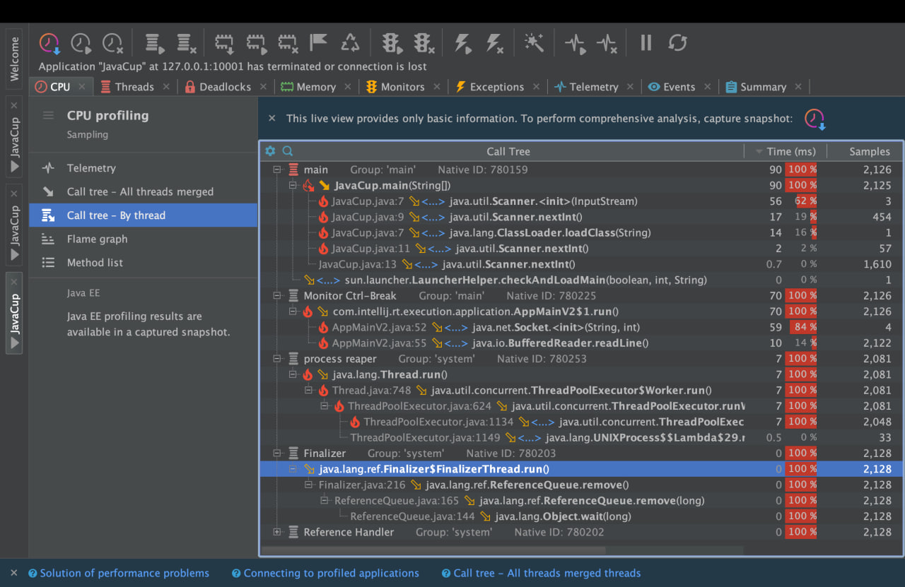
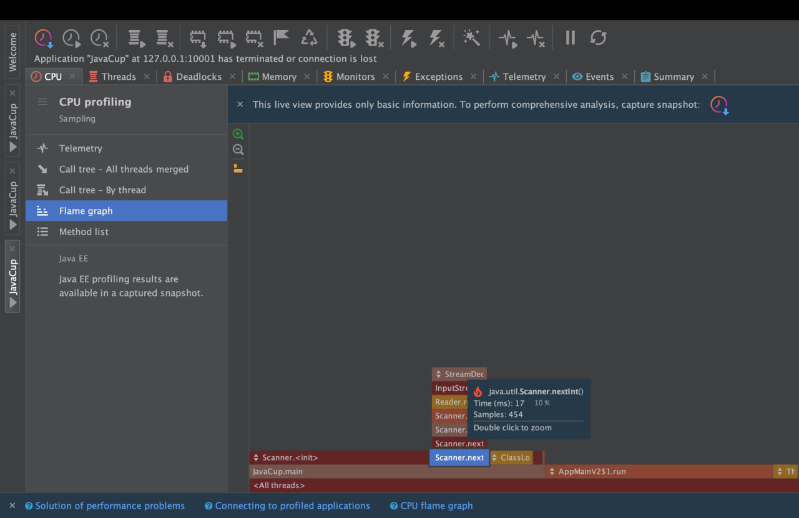
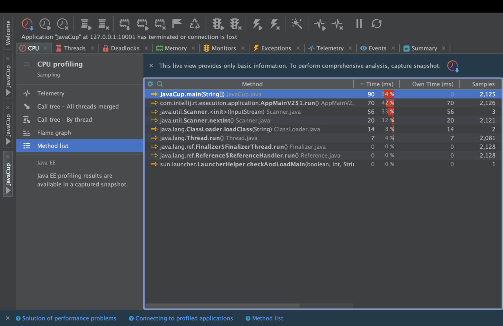
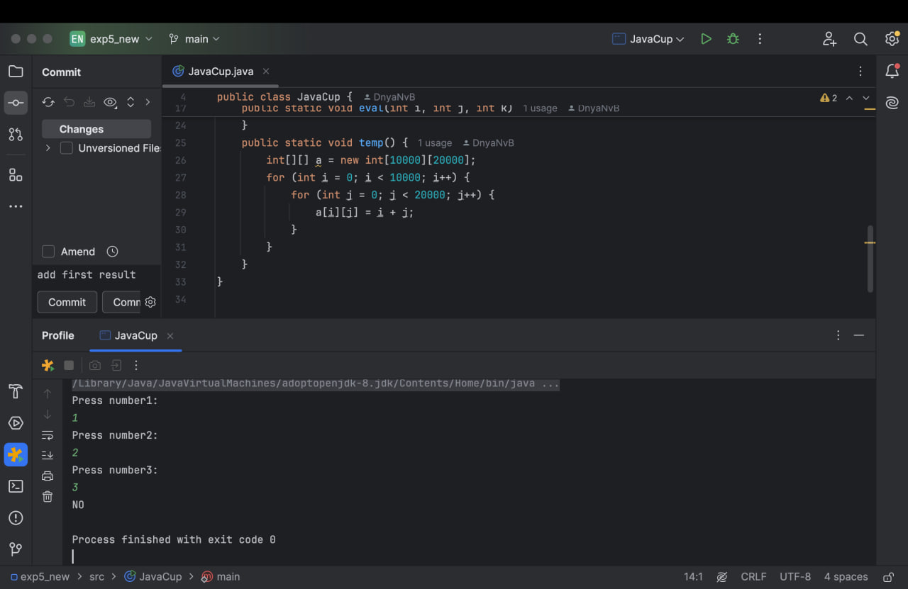

**سوال دوم**

در این بخش از پروژه، هدف این است که یک قطعه کد به زبان جاوا که از الگوریتم brute-force برای پیدا کردن نزدیک‌ترین جفت نقاط استفاده می‌کند را بهینه‌سازی کنیم. ابتدا با استفاده از ابزار **Yourkit**، عملکرد کد را پروفایل می‌کنیم تا بخش‌هایی از کد که بیشترین مصرف منابع (CPU و حافظه) را دارند شناسایی کنیم. سپس، کد را به گونه‌ای تغییر می‌دهیم که مصرف منابع نسبت به نسخه‌ی قبلی کاهش یابد.

کدی که در این بخش استفاده شده است، یک مجموعه از نقاط تصادفی را تولید می‌کند و سپس از الگوریتم brute-force برای محاسبه‌ی نزدیک‌ترین جفت نقاط در میان آنها استفاده می‌کند. در این الگوریتم، همه‌ی جفت‌های ممکن از نقاط بررسی می‌شوند و فاصله‌ی آنها محاسبه می‌شود تا نزدیک‌ترین جفت شناسایی شود. این روش با پیچیدگی زمانی **O(n²)** است که به‌ویژه برای مجموعه‌های داده‌ی بزرگ (مثل 100000 نقطه در این مثال) زمان و منابع زیادی مصرف می‌کند. تعداد نقاط در ورودی دریافت می‌شود.

در مرحله‌ی بعد، این کد بهینه‌سازی می‌شود تا مصرف منابع کاهش یابد و عملکرد بهتری در داده‌های بزرگتر داشته باشد. این کار از طریق استفاده از الگوریتم‌های بهینه‌تر مانند **Divide and Conquer** برای پیدا کردن نزدیک‌ترین جفت نقاط انجام می‌شود. با پیاده سازی کد به این روش پیچیدگی زمانی به خوبی کاهش می‌یابد.

در ادامه نتایج اجرای پروفایلینگ برای کد قبلا از بهینه کردن آن را مشاهده میکنیم. در این نتایج تابع findClosestPair همانطور که مشاهده می‌شود بیشترین تاثیر را در استفاده ار منابع دارد:

با استفاده از الگوریتم divide and conquer همانطور که در کد ClosestPairOpt در فولد section2 مشاهده میکنید سعی میکنیم فرایند پیدا کردن نزدیک ترین نقاط و تابع closestPair را بهینه کنیم و پس از انجام پروفالینگ به نتایج زیر می‌رسیم و مدت زمان استفاده از cpu همانطور که در عکس‌ها آمده است کاهش یافته است:

